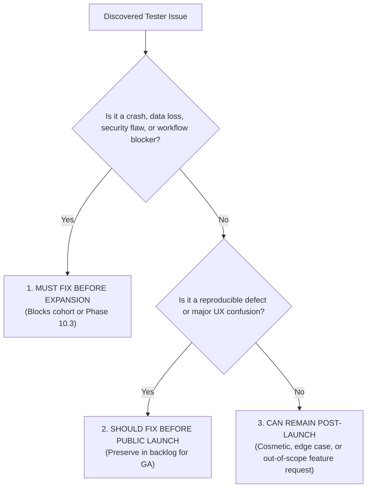

# SnapDeploy AI — Phase 10.1 Five-Person Beta Tracking Workbook

**Document Version:** 1.0.0  
**Phase:** 10.1 (Five-Person Controlled Beta Cohort)  
**Status:** READY FOR REAL HUMAN TESTERS (Sessions Pending)  
**Live Target:** [https://snapdeploy-ai.onrender.com](https://snapdeploy-ai.onrender.com)  

---

## 1. Operating Rules & Boundary Constraints

> [!IMPORTANT]
> **Zero Simulation / Zero Fabrication Policy**
> - All entries in this workbook MUST reflect actual human testing sessions.
> - Do NOT simulate human interactions or fabricate responses.
> - Phase 10.1 cannot be marked complete until 5 real testers have executed their sessions.

> [!CAUTION]
> **Strict Privacy & Secret Prohibition**
> NEVER record or commit:
> - Real API keys, tokens, or credentials
> - Passwords or PINs
> - Personally Identifiable Information (PII)
> - Proprietary/confidential company data

> [!NOTE]
> **Product Release Freeze**
> Product code is FROZEN during the 5-person beta cohort. No speculative refactoring or feature additions are permitted. Only genuine critical blockers (crashes, secret leaks, broken export, unrecoverable workflow failure) justify intervention.

---

## 2. Beta Cohort Roster & Persona Matrix

| Tester ID | Target Persona | Tester Background | Assigned Browser / OS | Testing Window (UTC) | Session Status |
| :--- | :--- | :--- | :--- | :--- | :---: |
| **TESTER-A** | Complete Beginner | Non-technical user; no prior coding or IDE experience | Chrome / Windows 11 | Pending Assignment | `NOT STARTED` |
| **TESTER-B** | Student / Casual Builder | Learning web development; familiar with basic HTML/CSS | Edge / Windows 10/11 | Pending Assignment | `NOT STARTED` |
| **TESTER-C** | Regular SaaS User | Product manager / no-code builder; uses Notion, Webflow, Retool | Chrome / macOS | Pending Assignment | `NOT STARTED` |
| **TESTER-D** | Technically Comfortable | Full-stack developer; writes React/TypeScript daily | Chrome / Linux or Mac | Pending Assignment | `NOT STARTED` |
| **TESTER-E** | Skeptical Reviewer | Senior engineer / QA architect; actively tests edge cases and limits | Brave / Windows or Mac | Pending Assignment | `NOT STARTED` |

---

## 3. Ten Canonical Beta Journeys

Each tester is guided through the 10 canonical journeys defined in [`BETA_TESTER_GUIDE.md`](./BETA_TESTER_GUIDE.md):

1. **Journey 1: Simple AI App Generation** — *"Minimalist counter button in React with Tailwind CSS"*
2. **Journey 2: Complex App Generation** — *"Kanban board with To-Do, In-Progress, and Done columns, drag-and-drop cards, and local storage"*
3. **Journey 3: Visual & Code Edit** — *"Change background to slate-900, text to white, and add a reset button"*
4. **Journey 4: Run / Live Preview** — Responsive viewports, terminal drawer inspection, button click reactivity
5. **Journey 5: Debug & Self-Healing** — Intentional syntax error (`const brokenVariable = ;`), automated diagnosis, diff inspection, patch apply
6. **Journey 6: Ship UI Inspection** — Deployment checklist modal rendering and checklist clarity
7. **Journey 7: ZIP Project Export** — Download `.zip`, inspect `package.json`, `src/App.tsx`, and truthful `README.md`
8. **Journey 8: Multi-Project Isolation** — Create Pomodoro timer, switch back and forth with Kanban board, verify zero cross-contamination
9. **Journey 9: Browser Refresh Persistence** — F5 hard reload, verify VFS files and active tabs persist from IndexedDB
10. **Journey 10: Graceful Error Recovery** — Empty prompt submission, >10,000 char prompt boundary test

---

## 4. Real Human Session Capture Logs

### Session Log Template (To Be Filled Per Tester)

```markdown
### Session Record: [TESTER-ID]
- **Persona**: [Complete Beginner | Student | SaaS User | Tech Comfortable | Skeptical Reviewer]
- **Date & Time (UTC)**: YYYY-MM-DD HH:MM - HH:MM UTC (Duration: X min)
- **Environment**: [Browser & Version] on [Operating System]
- **Primary Goal**: [Goal description]

#### Journey Log Table
| # | Journey | Action / Exact Prompt | Result | Duration | Request ID | HTTP | Continued? | Severity | Notes / Friction Observed |
| :-: | :--- | :--- | :---: | :-: | :--- | :-: | :---: | :---: | :--- |
| 1 | Simple App Gen |  | [PASS/PARTIAL/FAIL/BLOCKED] |  |  |  | [Y/N] | [None/Low/Med/Crit] |  |
| 2 | Complex App Gen |  |  |  |  |  |  |  |  |
| 3 | Visual & Code Edit |  |  |  |  |  |  |  |  |
| 4 | Run & Preview |  |  |  |  |  |  |  |  |
| 5 | Debug & Repair |  |  |  |  |  |  |  |  |
| 6 | Ship UI Review |  |  |  |  |  |  |  |  |
| 7 | ZIP Export |  |  |  |  |  |  |  |  |
| 8 | Multi-Project |  |  |  |  |  |  |  |  |
| 9 | Refresh Persist |  |  |  |  |  |  |  |  |
| 10 | Error Recovery |  |  |  |  |  |  |  |  |

#### AI Telemetry Captured
- **Prompt Tokens**: 
- **Candidate Tokens**: 
- **Cold-Start Encountered**: [Yes / No] (Duration: X ms)
- **Quota Remaining (Pre/Post)**: 
- **Outcome / Error Code**: 

#### Qualitative Observations
- **Time-to-First-Success**: 
- **Navigation Confusion Points**: 
- **User Understanding / Mental Model**: 
- **Screenshots / Evidence URIs**: 
```

*(Session records for TESTER-A, TESTER-B, TESTER-C, TESTER-D, and TESTER-E will be appended as tests are completed).*

---

## 5. Raw Beta Metrics Reference & Target Tracking

| Metric | Beta Acceptance Target | Actual Measured (Current Cohort) | Evidence / Source |
| :--- | :---: | :---: | :--- |
| **Generation Success Rate** | $\ge 90\%$ | *Pending human sessions* | Session records J1 |
| **Complex Gen Success Rate** | $\ge 80\%$ | *Pending human sessions* | Session records J2 |
| **Median AI Latency (p50)** | $< 35\text{s}$ | *Live `/api/ai/status` reporting 0ms (idle)* | `/api/ai/status` ring buffer |
| **p95 AI Latency** | $< 50\text{s}$ | *Pending human sessions* | `/api/ai/status` |
| **p99 AI Latency** | $< 60\text{s}$ | *Pending human sessions* | `/api/ai/status` |
| **HTTP 5xx Rate** | $< 2\%$ | *0% during pre-beta gate* | Server logs |
| **WebContainer Fatal Rate** | $0\%$ | *0% in Chromium verification* | DevTools console logs |
| **ZIP Export Success** | $100\%$ | *Pending human sessions* | Session records J7 |
| **Multi-Project Isolation** | $100\%$ (0 leaks) | *100% in Phase 9.2 verification* | Session records J8 |
| **Time-to-First-Success** | $< 3\text{ minutes}$ | *Pending human sessions* | Tester stopwatch |
| **Critical Issues** | $0$ | $0$ (Pre-beta gate clean) | Defect log |
| **Medium Issues** | $\le 3$ | *Pending triage* | Defect log |
| **Low Issues** | $\le 5$ | *Pending triage* | Defect log |

---

## 6. Critical Incident Intervention Log

If a critical defect blocks testing and necessitates a code change during the freeze:

| Incident ID | Timestamp (UTC) | Blocking Symptom & Evidence | Root Cause | Exact Minimal Fix | Verification & Retest | Cohort Impact / Comparability |
| :--- | :--- | :--- | :--- | :--- | :--- | :--- |
| *None* | — | *No critical incidents recorded* | — | — | — | Baseline intact |

---

## 7. Phase 10.2 Issue Triage Scheme

Discovered issues will be triaged into three strict categories based on reproducible evidence:



### Classification Guidance
- **Must Fix Before Expansion**:
  - Application freeze, uncaught exception, or blank screen.
  - Failure to generate applications or run WebContainer.
  - VFS data corruption, tab desynchronization, or project leak.
  - Security or secret leakage risk.
  - ZIP export missing critical project files.
- **Should Fix Before Public Launch**:
  - Confusing button labels or misleading status copy.
  - Minor layout truncation on specific resolutions.
  - Unhelpful error messages when upstream AI fails.
  - Sub-optimal Monaco scrolling behavior.
- **Can Remain Post-Launch**:
  - Feature requests outside current roadmap (e.g. multi-user live editing, Git push to GitHub, custom CSS frameworks).
  - Minor visual styling preferences.
  - Known infrastructure artifacts (e.g. Render 30-50s cold start on first load).
